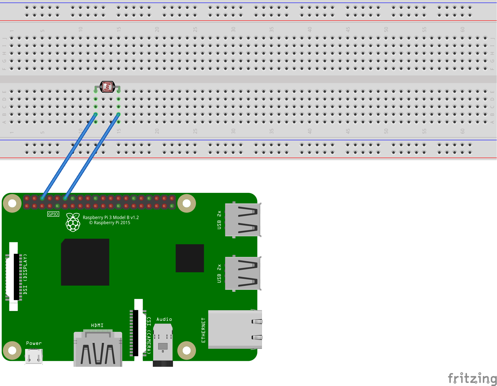

# Sensor LDR

O Sensor LDR é capaz de capturar a luminosidade presente do ambiente.

## Material Necessário

* Raspberry Pi com o sistema operacional Raspbian instalado
* Protoboard
* Jumpers tipo macho/fêmea

## Camadas do Projeto

Neste projeto há três camadas. Uma camada para interagir com o GPIO do Raspberry Pi, uma camada de integração e uma camada com uma página web para exibir o estado capturado pelo Sensor LDR.

### Primeira Camada - Script Python

Foi feito um código em Python que é responsável em interagir com o GPIO do Raspberry Pi, onde o código Python recupera o retorno do Sensor LDR e envia para a Segunda Camada.

### Segunda Camada - Integração MQTT

Para realizar a integração entre o Script em Python e a página web o projeto está usando um Broker MQTT. O protocolo MQTT é o padrão de Broker para o mundo IoT.

Para este projeto está sendo utilizado a ferramenta `Mosquitto` com a responsabilidade de realizar a integração entre a Primeira e Terceira Camada.

### Terceira Camada - Página Web

Página Web desenvolvida em `NodeJS` é responsavel em recuperar as informação que foram enviadas para o Broker MQTT e exibí-las na página HTML infomando o estado obtido do Sensor LDR se a luz do ambiente está acessa ou apagada.

## Execução do Projeto

Siga os passos abaixos para executar o projeto.

### Configuração GPIO Raspberry

A figura abaixo mostra deve ser configurado o GPIO do Raspberry.



### Script Python

Antes de mais nada altere a variável IP_MQTT do script Python que está localizado dentro da pasta `python` com o IP do servidor que estará o Broker MQTT. Segue o exemplo abaixo:

```python
IP_MQTT='127.0.0.1'
```

Agora basta levar o script para para o Raspberry Pi.

Antes de executar o script é necessário instalar a biblioteca `paho-mqtt` com o comando:

```bash
pip3 install paho-mqtt
```

Após a instalação execute o script com o seguinte comando:

```bash
python3 sendor-ldr.py
```

Obs.: A execução do script é feita a cada **10 segundos**. Portanto a cada 10 segundos teremos o estado de luminosidade do ambiente.

### MQTT - Mosquitto

Para executar o Mosquitto optei por utilizar o Docker, porém a imagem do Mosquitto disponível no Docker Hub ainda não tem suporte a arquitetura do RaspBerry PI, portanto é necessário executar o Mosquitto em uma máquina com arquitetura `amd`.

Para executar o Mosquitto no Docker utiliza o comando abaixo:
```bash
docker run -itd -p 1883:1883 eclipse-mosquitto
```

O modelo utilizado pelo padrão MQTT é o de `Publisher/Subscriber`. Neste projeto o Script Python recupera a informação recebido do Sensor LDR e faz uma publicação no Broker MQTT e a Página Web recuperá a informação através de uma assinatura no Broker MQTT.

Um outra opção é utilizar o Broker MQTT em um servidor público provido pelo próprio Mosquitto através do seguinte endereço: `iot.eclipse.org` na porta `1883`. Para maiores informações deste servidor público acesse o endereço: https://iot.eclipse.org/getting-started#sandboxes[https://iot.eclipse.org/getting-started#sandboxes]

Ainda existe outra opção que é instalar o Mosquitto. Inclusive é possível realizar a instalação no próprio Raspberry Pi. Para realizar a instalação acesso o endereço: https://mosquitto.org/download/[https://mosquitto.org/download/]

Obs.: É interessante que cada camada esteja em uma máquina separada para que seja visto a integração entre as camadas do projeto.

### Página Web

A Página Web como dito anteriormente foi desenvolvida em NodeJS, portanto é necessário instalar o NodeJS na máquina que você pretende executar o código. Para facilitar você pode utilizar Docker.

O primeiro passo que deve ser feito para executar a Página Web é executar o comando para realizar a instalação das dependências através do comando:

```bash
npm install
```

Neste arquivo `script.js` também devemos informar qual o endereço IP do servidor do Broker MQTT, altere a linha do código com o endereço IP.

```js
var client = mqtt.connect('mqtt://localhost');
```

Depois basta executar a aplicação com o comando:

```bash
npm script.js
```

Acesse a página através do link: `http://localhost:8080`

Obs.: Faça atualização da página para visualizar as informações providas pelo Sensor LDR.

### Resultado Final


## Referências

Raspberry Pi fridge monitor[https://www.raspberrypi.org/magpi/raspberry-pi-fridge-monitor/]
